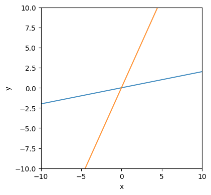
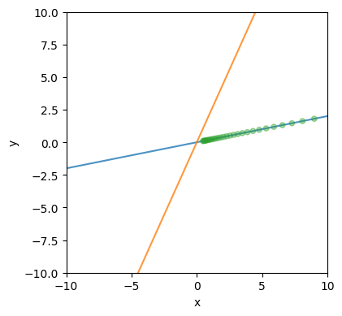
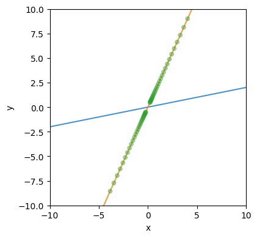
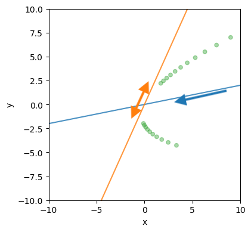
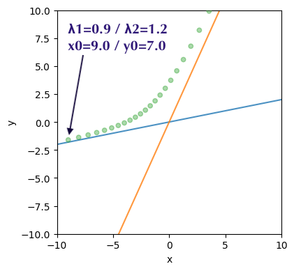
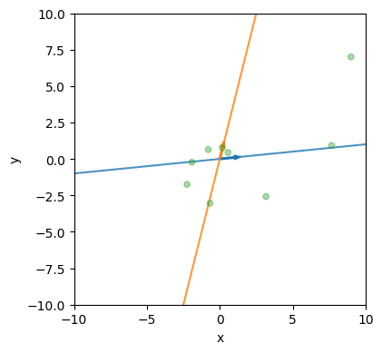

# 行列の固有値と動学

2次正方行列 $A$ が定義する動学システム

$$
x_{t+1} = Ax_t
$$

の挙動 $x_0, x_1, x_2, \dots$ と $A$ の固有値・固有ベクトルの関係を解説する。
簡単のため、対角化が可能なケースに分析を限定する。

応用上は $A$ が与えられたときの挙動を固有値と固有ベクトルを通して調べる。この学習用のシミュレータでは、固有値と固有ベクトルをまず与えて、どのような動学が生まれるかを調べられるようにしている。

## 基礎

固有値、固有ベクトルの定義をおさらいしておこう。すべての成分がゼロではない（一般には複素数成分をもつ）ベクトル $v$ と（一般には複素）数 $\lambda$ があって、

$$
Av = \lambda v
$$

が成り立つとき、 $\lambda$ は $A$ の固有値、 $v$ は $\lambda$ に対応する固有ベクトルであるという。固有ベクトルはあたかも1つだけ存在するように思えるが、固有ベクトルの定数倍も固有ベクトルであることに注意しておく。

2✕2行列の固有値は重複を込めて2つ存在して ($\lambda_1, \lambda_2$)、それぞれ対応する固有ベクトルが存在する($v_1, v_2$)。

$$
\begin{aligned}
Av_1 &= \lambda_1 v_1\\
Av_2 &= \lambda_2 v_2
\end{aligned}
$$

これを次のように書く（上の2式を、2x2行列の各列ごとに等号が成り立っていると見た）

$$
A \begin{bmatrix} v_1 & v_2 \end{bmatrix} = 
\begin{bmatrix} v_1 & v_2 \end{bmatrix} 
\begin{bmatrix}
\lambda_1 & 0\\
0 & \lambda_2
\end{bmatrix}
$$

ここで、

$$
\begin{aligned}
V &= \begin{bmatrix} v_1 & v_2 \end{bmatrix}\\
\Lambda &= \begin{bmatrix}
    \lambda_1 & 0\\
    0 & \lambda_2
\end{bmatrix}
\end{aligned}
$$

とおくと、

$$
AV = V \Lambda
$$

と書ける。**対角化可能**というのは、 $V$ が逆行列を持っていて、

$$
A = V \Lambda V^{-1}
$$

とできるケースである。固有値が相異なる場合には必ず対角化可能である。

## 実固有値のケース

固有値 $\lambda_1$, $\lambda_2$ が実数であるとしよう。固有ベクトルが作る行列 $V = [v_1 \ v_2]$ が逆行列を持つということは、 $v_1$ と $v_2$ が1次独立であるということ。つまり、各固有ベクトルを前後に伸ばした直線が原点のみで交わっている。本シミュレータでは $v_1$ が青線、 $v_2$ が橙線に対応している。これらの直線は、各固有値に対応する**固有空間**という。

初期値を固有値の定数倍に設定して、シミュレーションをすると、軌道が固有空間に閉じ込められていることが確認できる。

固有値が実数で対角化が可能な場合、それぞれの固有空間に沿った動きを重ね合わせることで全体の動きを構築できる。

例えば、 $\lambda_1 = 0.9$, $\lambda_2 = -0.95$, $v_1 = (1.0, 0.2)$, $v_2 = (0.45, 1.0)$ の場合、青軸($v_1$)に沿って原点に向かう動きと、橙軸 ($v_2$) に沿った方向に前後行き来する動きの組み合わせで、全体の動きが決まる。

固有値が1より小さいとき原点に収束、1より大きいときには無限大に発散するが、これも対応する固有空間の中での収束発散である。 $\lambda_1 = 0.9$, $\lambda_2 = 1.2$ の場合、青軸($v_1$)と平行な方向には収束（橙軸に向かって収束する）、橙軸($v_2$)方向には発散する（青軸から離れる方向に発散する）。

## 複素固有値のケース

$A$ が実行列で、固有値が複素数の場合、

$$
A v = \lambda v
$$

共役複素数も自動的に固有値になる。

$$
A \bar v = \bar \lambda \bar v
$$

ここで、固有値・固有ベクトルをそれぞれ実部と虚部に分解しよう。 $\alpha, \beta$ は実ベクトル ($\beta \neq 0$)、 $s, t$ は実数である ($t \neq 0$)。 $j$ は虚数単位($j^2 = -1$)とする。

$$
v = \alpha + \beta j
$$

$$
\lambda = s + tj
$$

固有値の条件から、

$$
A(\alpha + \beta j) = (s + tj)(\alpha + \beta j)
$$ 

なので、

$$
\begin{aligned}
A \alpha &= s\alpha - t \beta\\
A \beta &= t\alpha + s \beta
\end{aligned}
$$

すなわち、

$$
\begin{aligned}
A \begin{bmatrix}\alpha & \beta \end{bmatrix} = 
\begin{bmatrix}\alpha & \beta \end{bmatrix}
\begin{bmatrix}
s & -t \\
t & s
\end{bmatrix}
\end{aligned}
$$

ここで

$$
V = \begin{bmatrix}\alpha & \beta \end{bmatrix}
$$

とおくと、 $A$ が複素固有値を持つという設定から $V$ が逆行列を持つことが証明できる。また、固有値 $\lambda$ を極座標表示して

$$
\lambda = |\lambda| (\cos \theta + j\sin \theta)
$$

とするとき、

$$
\begin{bmatrix}
s & -t\\
t & s
\end{bmatrix} = 
|\lambda| 
\begin{bmatrix}
\cos \theta & -\sin \theta\\
\sin \theta & \cos \theta
\end{bmatrix} =: 
|\lambda| R(-\theta)
$$

である。 $R(-\theta)$ はベクトル $(x, y)$ を時計回りに角度 $\theta$ だけ回転させる回転行列である。

ベクトル $\boldsymbol{x}$ に行列 $A$ を掛ける操作は次のように分解できる。

ここで「時計回り」という言葉づかいには注意をしておこう。 $\alpha$ を第1軸（横軸）、 $\beta$ を第2軸（縦軸）としたときに、 $\alpha$ から $\beta$ に向かう回転が「反時計回り」、 $\beta$ から $\alpha$ に向かう回転が「時計回り」と定義する。

$$
\begin{aligned}
\lambda &= 0.5 + 0.5j\\
v &= \begin{bmatrix}
1 + 0.2j\\
0.1 + 0.8j
\end{bmatrix}
\end{aligned}
$$

のとき、第1軸 $\alpha$ と 第2軸 $\beta$ はそれぞれ

$$
\alpha = 
\begin{bmatrix}
1 \\ 0.1
\end{bmatrix},\qquad
\beta =
\begin{bmatrix}
0.2 \\ 0.8
\end{bmatrix}
$$

である。初期値 $(9, 7)$ から始まる軌道は下図のようになる。青軸が $\alpha$ 、橙軸が $\beta$ で、橙から青に向かって回転する時計回りの回転になっている。

